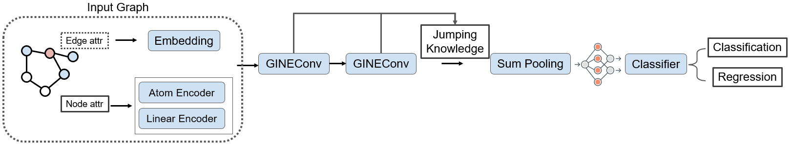
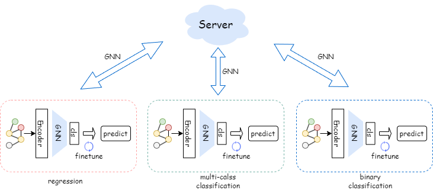

# CIKM AnalytiCup-2022

This is the source code for CIKM 2022 AnalytiCup Competition [[link](https://tianchi.aliyun.com/competition/entrance/532008/introduction)]. This repo is developed based on the federated learning framework [FederatedScope](https://github.com/alibaba/FederatedScope).

Team name: **GTML-GEAR**, Final Score: **55.2703**

# Requirements

+ Python 3.9 (lower version should be available, with necessary modification on `setup.py`)
+ Install PyTorch 1.12 from [here](https://pytorch.org/get-started/locally/)
+ Install PyG 2.1.0 and its dependencies from [here](https://pytorch-geometric.readthedocs.io/en/latest/notes/installation.html)
+ Install the basic environments: `python setup.py install`

# Reproduction

+ To run the code:

```sh
python federatedscope/main.py --cfg federatedscope/gfl/baseline/fedavg_gin_minibatch_on_cikmcup.yaml --client_cfg federatedscope/gfl/baseline/fedavg_gin_minibatch_on_cikmcup_per_client.yaml
```

# Our Solution

Our solution is completely based on the federated learning framework [FederatedScope](https://github.com/alibaba/FederatedScope), which mainly  consist of two main components: a GNN model and a federated learning algorithm.


## GNN Model


<p align="center">  <p align="center">Figure 1. Algorithm framework of GNN model.</p>


- Brief introduction of the developed algorithm:

> 1. The algorithm framework of adopted GNN model is shown in Figure 1
> 2. The hidden layer dimension is set to `512`, and the number of local updates is `10` epochs (except client9, 10, and 13, which are set to `1`).
> 3. We add `BatchNorm` layer in the GNN_Net_Graph before classification
> 4. We embed the `edge_attr` of the graph data and adopt the `GINEConv` layer to encode the graph data
> 5. We apply sum pooling (`global_add_pool`) to the pooling layer to make the model better distinguish between graph structures
> 6. We use Jumping Knowledge attention in the GNN model to adaptively capture information from multi-hop neighbors
> 7. We set the dropout rate to `0` to better improve the performance of the regression task.
> 8. We record the best performance of the model on the validation set in each client, and save the best parameters for prediction.
> 9. Finally, we incorporate validation set data during training to improve our score.

## Federated Learning Algorithm

<p align="center">  <p align="center">Figure 2. Algorithm framework of our federated learning method.</p>

- If it is a federated learning method:

> Our solution is an algorithm based on federated learning.
>
> 1. The algorithm framework of adopted federated learning  method is shown in Figure 2
> 2. We use "FedBN+ft" as the main framework of heterogeneous task federated learning
> 3. First, the type of information transmitted between client and server is "model_para", which includes "sample_size" and "model_para_all".
> 4. Second, our federated learning algorithm is the baseline "FedBN".
> 5. Furthermore, we adopt a "finetune" approach before evaluating, which uses the training, validation, and test data (excluding labels) to finetune the "running_mean" and "running_var" of the BatchNorm layer.
> 6. Finally, the large variation in the size of the client local data results in a large variation in the number of local updates performed by each client in each round of communication. To face this problem, we differentially adjust the number of local updates on each client to improve the convergence speed and performance of the global model (similar to FedNova).


Current implementation can achieve the highest score of 52.8419. To further improve the score, we ensemble the prediction results under 5 different runs, each with different differences on the config. The prediction result of each run is saved at `exp/predictions_all/` folder. Then, we run the script `python ensemble.py` to obtain the ensembled result saved at `prediction.csv`. Finally, we got our best result 55.2703.